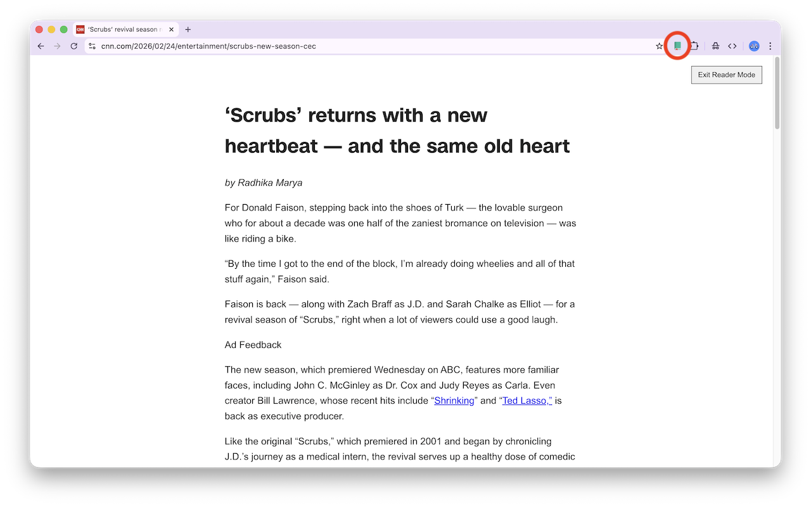
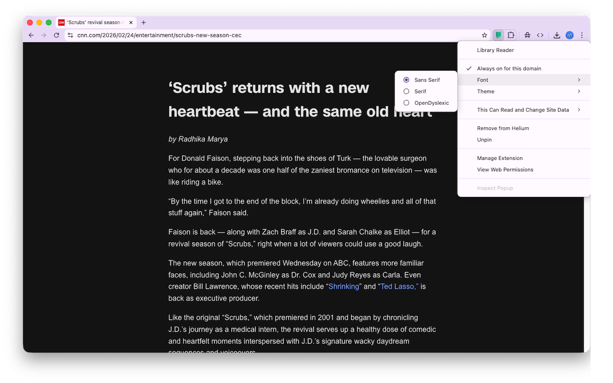

# library-reader Chromium Extension

This browser extension adds a simple reader mode, using [Mozilla's readability library](https://github.com/mozilla/readability). Want to try the beta?

* [Download the latest beta release](https://github.com/FlipperPA/library-reader/releases/) and unzip it
* Open your extensions `chrome://extensions` or `helium://extensions`
* Toggle `Developer mode` to be on, if it is off
* Select `Load Unpacked` and point to the unzipped folder

## Example of a CNN Article

Left click the extension icon to toggle Reader Mode. `Ctrl+Space` will also toggle.

| Before | After |
| ------------- | ------------- |
|  |  |

## Right Click the Extension Icon for Options

* `Always on for this domain`: toggles automatic activation of reader mode during any visit to the current domain.
* `Font`: choose `Sans Serif` (default), `Serif`, or `OpenDyslexic` for a font [designed for dyslexic readers](https://opendyslexic.org/). 
* `Theme`: choose `Light` (default), `Dark`, or `Color Blind Safe`



## Developers: Build and Package for Upload

```bash
cd library-reader
node build.js
zip -r library-reader.zip manifest.json assets/style.css assets/dist assets/icons
```

## Privacy Policy

This extension does not collect any user data.
